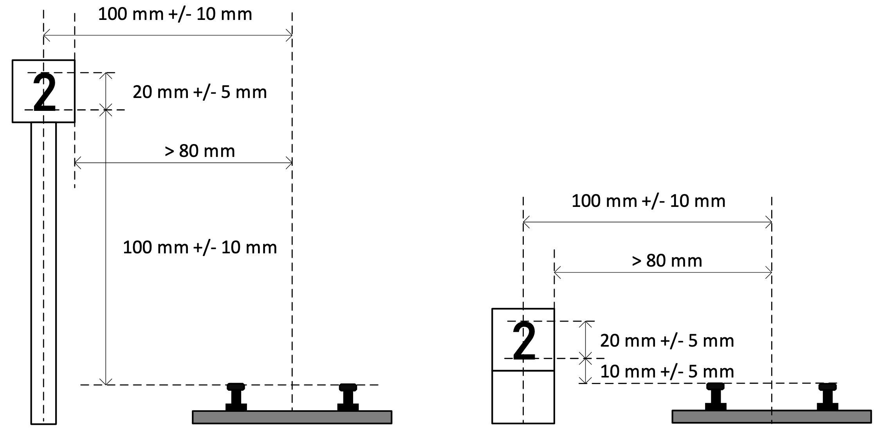

# Train Control System

This repository does hold the code base for the project "Hochgeschwindgkeitschienenfahrzeug" created during the PREN modul at the University of Applied Science Lucerne (HSLU) in the year 2018/2019.
The interdisciplinary project consisted of students of the field of electrical engineers, machine engineers and computer scientists. During one year the goal was to plan and build a model-scaled train which had to drive through a railsystem while executing tasks.
A number recognition task was central to the project and main challenge for the computer scientists. This repository holds the used code base for the Team 9. The module for the real-time number recognition is considered to be the main contribution.
The detection module is also publically available as a separate repository (https://github.com/FabianGroeger96/cnn-number-detection).

**NOTE: The code in this repository is not meant for easy reusability as it needs a specifically designed train. The repository is meant to be an indication for similar projects. It is also used as personal portfolio.**

## Challenge

The image below does shows a (possible) track situation. The teams in the module created a model-scaled train intended to follow the track and execute several tasks.
To create the track 45mm model rails were used (Märklin Spur 1). The rails were wired to a current of 20V and 3A.

The task and most important rules are provided in the list below.

**Tasks**

- Load a wooden cube at the start of the track on to the train.
- Complete two rounds of the track as fast as possible without loosing the cube.
- Halt at the halt signal (Haltesignal) which is signalized by the info signal (Infosignal). The signalization is done with a number.

**Rules**

- The engine of the train must be run with the electricity provided by the rails.
- The end of a round is signalized with a specific round signal.
- The train needs to pass the clearance gauge (Lichtraumprofil) without touching it.

### Track layout

### Scheme of signals

### Image of signals from train

## Train Design

To give a rough idea about the trains design the central elements will be mentioned. Also, the provided picture should give a general idea about the end results.

- **Current collector**
    - Current is collected through the wheels (Aluminium) and the use of copper bearings.
    - Additionally a battery was used to ensure consistent supply to the computational ressources.
- **Engine**
    - 12V DC Motor controlled by Arduino Motorshield
- **Loading Crane**
    - Stepper Motor
- **Motor Control Unit**
    - Arduino with Motorshields
- **Control Unit**
    - Rapsberry PI 3
- **Camera**
    - Raspberry PI Camera
    - LED Light
- **Sensors**
    - Ultra-Sonic

## Code Modules

The code contains of different software modules used to fulfill the challenge.

- **TrainControlSystem**: Acting as a state machine and connection all modules together. The different steps of the challenges are executed sequentially.
- **Train**: Module abstracting the train including the communication with the Arduino board.   
- **Goldeneye**: Module for the signal detection system.
    - **Camera**: Interface to the Raspberry PI camera
    - **Recognizer**: System to detect signal type and number on images provided by the camera.
    - **SignalTrackingSystem**: System to track and verify seen signals based on a strike system.
    - **ImageProcessor**: Process to allow multiple processes executing the recognizer task. 
    - **Goldeneye**: Wrapper class for the detection system. Does initialize the camera and multiple ImageProcessors.
    - **ImageLabler**: Helper to label images for visualization
    - **Simpleye**: Camera without recognition for testing
    - **WebServer**: Simple webserver to make camera stream available in real-time
   
## Number detection

With the above code and components it was possible to reach a real-time signal detection processing around 35 frames per second on the Raspberry PI.
Not only the detection is lightweight, also the usage of the Raspberry PI camera is implemented in a fast as possible way. To do so the camera stream is directly processed as a byte stream.
The number detection was isolated and made available in a separate repository.

**Repository for Number detection:** https://github.com/FabianGroeger96/cnn-number-detection

## Disclaimer

The repository is not refactored or intended to work out of the box. As stated the usage of the code does require a specific setup to work.
It is published as a reference point for similar projects. If you have questions please open an issue in this project. Questions about the number detection should be posted in the specific repository.

